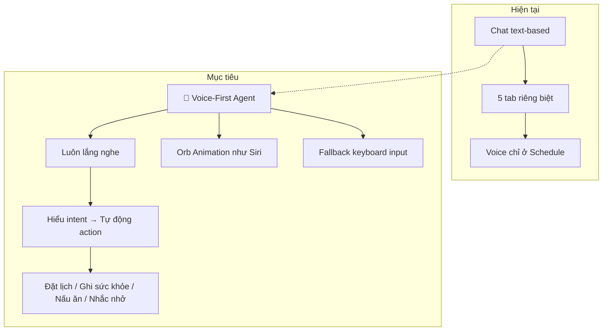
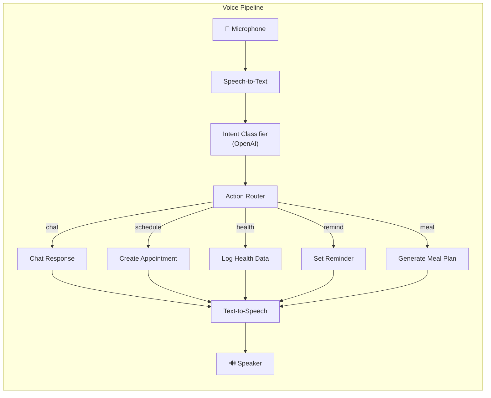

# Nâng cấp ButlerX thành Mobile AI Agent (kiểu Siri)

## Tổng quan hiện trạng

Sau khi phân tích toàn bộ codebase, đây là bức tranh hiện tại:

### ✅ Đã hoàn thành tốt
| Feature | Trạng thái | Chi tiết |
|---------|-----------|----------|
| **Auth** | ✅ FakeAuth hoạt động | Login, Register, Onboarding hoàn chỉnh |
| **Chat + OpenAI** | ✅ Streaming hoạt động | GPT-4o, persona prompt theo tuổi/giới tính |
| **Scheduling** | ✅ Tương đối đầy đủ | Calendar, Voice intent parser, CRUD |
| **Health** | ✅ Hoạt động | Ghi chép chỉ số, BMI, huyết áp |
| **Meal Plan** | ✅ Hoạt động | AI generate thực đơn 7 ngày |
| **TTS** | ✅ Hoạt động | Đọc to phản hồi tiếng Việt |
| **Theme** | ✅ Light/Dark/System | FlexColorScheme + Google Fonts |
| **Onboarding** | ✅ 5 bước | Tên, ngày sinh, giới tính, xưng hô, tính cách |

### ❌ Chưa hoàn chỉnh / Thiếu
| Vấn đề | Mức độ | Chi tiết |
|--------|--------|----------|
| **Reminders feature** | 🔴 Trống rỗng | Folder có structure nhưng **không có file code** |
| **Firebase Auth** | 🟡 Chưa kích hoạt | `FirebaseAuthRepository` có code nhưng dùng `FakeAuthRepository` |
| **STT (Speech-to-Text)** | 🔴 Chưa tích hợp | Dependency `speech_to_text` có nhưng chưa dùng ở chat |
| **Chat không có voice input** | 🔴 Thiếu | Chat chỉ có text input, không có nút microphone |
| **Empty page (demo)** | 🟡 Code thừa | `empty_page.dart` là demo Riverpod, link từ Settings |
| **Drift database** | 🔴 Chưa dùng | Dependency có nhưng chưa setup (dùng SharedPreferences) |
| **Conversation history** | 🟡 Không có UI | Repository hỗ trợ nhưng không có UI xem lại lịch sử |
| **Profile editing** | 🟡 Thiếu | Không có UI sửa profile sau onboarding |
| **OCR/Handwriting** | 🔴 Chưa tích hợp | `google_mlkit_digital_ink_recognition` chỉ khai báo |
| **Charts** | 🔴 Chưa dùng | `fl_chart` chưa có trong health/meal plan |
| **assets trống** | 🟡 | `animations/`, `images/`, `fonts/` đều trống |
| **Reminders data/domain** | 🔴 | Folder structure có nhưng 0 file |

---

## Mục tiêu: Biến ButlerX thành Siri-like Agent



---

## Phase 1: Hoàn thiện các feature chưa hoàn chỉnh

> [!IMPORTANT]
> Phase này tập trung fix tất cả những gì đang dang dở trước khi thêm tính năng mới.

### 1.1 Reminders Feature

#### [NEW] [reminder_entity.dart](file:///d:/Projects/butlerx/butlerx/lib/features/reminders/domain/entities/reminder_entity.dart)
- Entity `Reminder` với các field: `id`, `title`, `body`, `scheduledAt`, `repeatRule`, `isActive`, `linkedAppointmentId?`
- Enum `RepeatRule`: `none`, `daily`, `weekly`, `monthly`

#### [NEW] [reminder_repository.dart](file:///d:/Projects/butlerx/butlerx/lib/features/reminders/data/repositories/reminder_repository.dart)
- CRUD cho reminders, lưu vào SharedPreferences (tương tự pattern chat_repository)
- Phương thức: `create`, `update`, `delete`, `listActive`, `listAll`

#### [NEW] [reminder_notifier.dart](file:///d:/Projects/butlerx/butlerx/lib/features/reminders/presentation/providers/reminder_notifier.dart)
- Riverpod notifier quản lý state
- Tích hợp với `ReminderService` (scheduling local notifications)

#### [NEW] [reminders_page.dart](file:///d:/Projects/butlerx/butlerx/lib/features/reminders/presentation/pages/reminders_page.dart)
- UI hiển thị danh sách nhắc nhở
- FAB thêm mới, swipe to delete
- Toggle active/inactive

---

### 1.2 Tích hợp STT vào Chat

#### [NEW] [stt_service.dart](file:///d:/Projects/butlerx/butlerx/lib/shared/services/stt_service.dart)
- Wrapper cho `speech_to_text` package
- Auto-detect Vietnamese locale `vi-VN`
- Stream recognition results
- Xử lý permissions

#### [MODIFY] [chat_page.dart](file:///d:/Projects/butlerx/butlerx/lib/features/chat/presentation/pages/chat_page.dart)
- Thêm nút microphone vào `_InputBar` (bên trái nút send)
- Khi nhấn: bắt đầu listening, text hiển thị real-time vào TextField
- Khi dừng: auto-send message

#### [MODIFY] [chat_notifier.dart](file:///d:/Projects/butlerx/butlerx/lib/features/chat/presentation/providers/chat_notifier.dart)
- Thêm state `isListening` 
- Method `startListening()`, `stopListening()`
- Cập nhật `OrbState.listening` khi đang nghe

---

### 1.3 Dọn dẹp code thừa

#### [DELETE] [empty_page.dart](file:///d:/Projects/butlerx/butlerx/lib/features/empty/empty_page.dart)
- Xóa demo Riverpod page không cần thiết

#### [MODIFY] [settings_page.dart](file:///d:/Projects/butlerx/butlerx/lib/features/settings/presentation/pages/settings_page.dart)
- Bỏ link đến `RiverpodCounterPage`
- Bật lại `_ProfileCard` (đang bị comment)
- Thêm mục "Sửa hồ sơ" navigate đến profile editor

---

### 1.4 Health Charts

#### [MODIFY] [health_page.dart](file:///d:/Projects/butlerx/butlerx/lib/features/health/presentation/pages/health_page.dart)
- Thêm tab/section biểu đồ dùng `fl_chart`
- Line chart cho cân nặng, huyết áp theo thời gian
- BMI gauge chart

---

### 1.5 Conversation History UI

#### [NEW] [conversation_list_page.dart](file:///d:/Projects/butlerx/butlerx/lib/features/chat/presentation/pages/conversation_list_page.dart)
- Danh sách cuộc trò chuyện cũ
- Tìm kiếm, xóa conversation
- Navigate từ Chat AppBar

---

## Phase 2: Siri-like Voice Agent Core

> [!IMPORTANT]
> Đây là phase quan trọng nhất — biến ButlerX từ chat app thành AI agent.

### 2.1 Architecture tổng quát



### 2.2 Intent Classification System

#### [NEW] [intent_classifier.dart](file:///d:/Projects/butlerx/butlerx/lib/core/agent/intent_classifier.dart)
- Dùng OpenAI GPT-4o-mini để phân loại intent từ text
- Trả về structured JSON: `{ intent, entities, confidence }`
- Các intent: `chat`, `schedule.create`, `schedule.query`, `reminder.create`, `health.log`, `meal.generate`, `settings.change`

```dart
/// Example output:
/// { "intent": "schedule.create", "entities": { "title": "Khám răng", "time": "sáng mai" }, "confidence": 0.95 }
```

#### [NEW] [action_router.dart](file:///d:/Projects/butlerx/butlerx/lib/core/agent/action_router.dart)
- Nhận kết quả phân loại intent
- Dispatch action tương ứng đến các feature notifiers
- Trả về kết quả text để TTS đọc lại

#### [NEW] [agent_notifier.dart](file:///d:/Projects/butlerx/butlerx/lib/core/agent/agent_notifier.dart)
- Riverpod provider trung tâm quản lý toàn bộ voice pipeline
- State: `idle` → `listening` → `processing` → `speaking` → `idle`
- Kết nối STT → Intent Classifier → Action Router → TTS

---

### 2.3 Siri-style Voice Overlay

#### [NEW] [voice_agent_overlay.dart](file:///d:/Projects/butlerx/butlerx/lib/shared/widgets/voice_agent_overlay.dart)
- Full-screen overlay khi kích hoạt voice (giống Siri)
- Animated orb ở trung tâm (nâng cấp từ `JarvisOrb`)
- Hiển thị transcript real-time
- Hiển thị response text
- Waveform animation khi đang nghe
- Tap anywhere để dismiss

#### [NEW] [voice_waveform.dart](file:///d:/Projects/butlerx/butlerx/lib/shared/widgets/voice_waveform.dart)
- Audio waveform animation bars
- React to audio level từ STT

#### [MODIFY] [jarvis_orb.dart](file:///d:/Projects/butlerx/butlerx/lib/features/chat/presentation/widgets/jarvis_orb.dart)
- Nâng cấp animation mượt hơn
- Thêm particle effects khi `speaking`/`thinking`
- Gradient glow effect

---

### 2.4 Floating Agent Button (FAB toàn cục)

#### [NEW] [agent_fab.dart](file:///d:/Projects/butlerx/butlerx/lib/shared/widgets/agent_fab.dart)
- Floating button luôn hiển thị ở mọi screen (giống nút Siri)
- Long press → mở Voice Overlay
- Tap → toggle listening
- Animation pulse khi idle
- Draggable position

#### [MODIFY] [home_shell.dart](file:///d:/Projects/butlerx/butlerx/lib/shared/ui/home_shell.dart)
- Tích hợp `AgentFab` vào layout
- Stack overlay lên trên child content

---

## Phase 3: Smart Action Execution

### 3.1 Đặt lịch bằng giọng nói (nâng cấp)

#### [MODIFY] [voice_intent_parser.dart](file:///d:/Projects/butlerx/butlerx/lib/features/scheduling/data/services/voice_intent_parser.dart)
- Tích hợp với `IntentClassifier` thay vì tự gọi OpenAI riêng
- Reuse action router

### 3.2 Ghi chép sức khỏe bằng giọng nói

#### [NEW] [health_voice_handler.dart](file:///d:/Projects/butlerx/butlerx/lib/features/health/data/services/health_voice_handler.dart)
- Parse voice input: "Huyết áp hôm nay 120/80, nhịp tim 75"
- Auto-create HealthRecord

### 3.3 Nhắc nhở bằng giọng nói

#### [NEW] [reminder_voice_handler.dart](file:///d:/Projects/butlerx/butlerx/lib/features/reminders/data/services/reminder_voice_handler.dart)
- Parse: "Nhắc tôi uống nước mỗi 2 tiếng"
- Auto-create Reminder với repeat rule

### 3.4 Trả lời thông minh qua context

#### [MODIFY] [persona_prompt_builder.dart](file:///d:/Projects/butlerx/butlerx/lib/features/chat/domain/persona_prompt_builder.dart)
- Inject context từ các feature: upcoming appointments, health trends, today's meal plan
- Giúp AI trả lời thông minh hơn: "Chiều nay anh có lịch khám răng lúc 2h nhé"

---

## Phase 4: UI/UX Premium (Siri-inspired)

### 4.1 Splash Screen mới

#### [MODIFY] [router.dart](file:///d:/Projects/butlerx/butlerx/lib/app/router.dart)
- Nâng cấp `_SplashScreen` với Lottie animation
- Fade-in logo + tagline animation
- Auto-navigate sau 2s

### 4.2 Chat UI nâng cấp

#### [MODIFY] [chat_page.dart](file:///d:/Projects/butlerx/butlerx/lib/features/chat/presentation/pages/chat_page.dart)
- Glassmorphism cho message bubbles
- Smooth scroll animations
- Typing indicator cải tiến
- Quick action chips dựa trên context

### 4.3 Bottom Nav nâng cấp

#### [MODIFY] [home_shell.dart](file:///d:/Projects/butlerx/butlerx/lib/shared/ui/home_shell.dart)
- Custom bottom nav với notch cho Agent FAB ở giữa
- Active tab animations
- Badge notifications

### 4.4 Lottie Animations

- Thêm Lottie files cho: splash, empty states, loading, success
- Download từ LottieFiles hoặc custom

---

## Phase 5: Polish & Production-Ready

### 5.1 Firebase Integration

#### [MODIFY] [main.dart](file:///d:/Projects/butlerx/butlerx/lib/main.dart)
- Thêm `Firebase.initializeApp()`

#### [MODIFY] [auth_provider.dart](file:///d:/Projects/butlerx/butlerx/lib/features/auth/presentation/providers/auth_provider.dart)
- Switch sang `FirebaseAuthRepository`

### 5.2 Background Services

- Notification service initialization on app start
- Background reminder scheduling

### 5.3 Error Handling & Offline

- Network connectivity check
- Offline mode cho features không cần AI
- Graceful error UI

### 5.4 Testing

- Unit tests cho IntentClassifier, ActionRouter
- Widget tests cho Voice Overlay
- Integration test cho voice pipeline

---

## User Review Required

> [!WARNING]
> **Firebase Configuration**: Bạn đã setup Firebase project chưa? Nếu chưa thì Phase 5.1 sẽ cần bạn:
> 1. Tạo project trên Firebase Console
> 2. Download `google-services.json` (Android) và `GoogleService-Info.plist` (iOS)
> 3. Chạy `flutterfire configure`

> [!IMPORTANT]
> **OpenAI API costs**: Voice agent sẽ gọi thêm API cho intent classification (mỗi lần nói). Recommend dùng `gpt-4o-mini` cho classifier để tiết kiệm chi phí.

## Open Questions

> [!IMPORTANT]
> 1. **Mức độ ưu tiên**: Bạn muốn tập trung vào phase nào trước? Đề xuất thứ tự: Phase 1 → Phase 2 → Phase 3 → Phase 4 → Phase 5
> 2. **Wake word**: Có muốn hỗ trợ wake word (ví dụ "Hey Butler") để kích hoạt voice mà không cần nhấn nút? Cần thêm package `porcupine_flutter` hoặc tương tự.
> 3. **Firebase**: Bạn muốn giữ FakeAuth cho development hay chuyển sang Firebase ngay?
> 4. **Ngôn ngữ**: App hiện chỉ hỗ trợ tiếng Việt. Có muốn thêm English?
> 5. **Target platforms**: Chỉ mobile (Android/iOS) hay cả web?
> 6. **Drift database**: Có muốn migrate từ SharedPreferences sang Drift (SQLite) cho performance tốt hơn với dữ liệu lớn?

---

## Verification Plan

### Automated Tests
- `flutter test` — chạy toàn bộ unit tests
- `flutter analyze` — check lint errors  
- Integration tests cho voice pipeline flow

### Manual Verification
- Test voice input trên thiết bị thật (STT cần microphone hardware)
- Test TTS đọc tiếng Việt
- Test notification scheduling
- Test full flow: Voice → Intent → Action → Response → TTS

### Browser/Emulator Testing
- Chạy `flutter run` trên Android emulator
- Verify tất cả screens và navigation
- Test dark mode / light mode

---

## Ước lượng thời gian

| Phase | Thời gian | Mô tả |
|-------|-----------|-------|
| Phase 1 | ~2-3 ngày | Hoàn thiện features dang dở |
| Phase 2 | ~3-4 ngày | Voice agent core + overlay UI |
| Phase 3 | ~2-3 ngày | Smart action routing |
| Phase 4 | ~2 ngày | UI/UX premium polish |
| Phase 5 | ~2-3 ngày | Firebase + production polish |
| **Tổng** | **~11-16 ngày** | |
